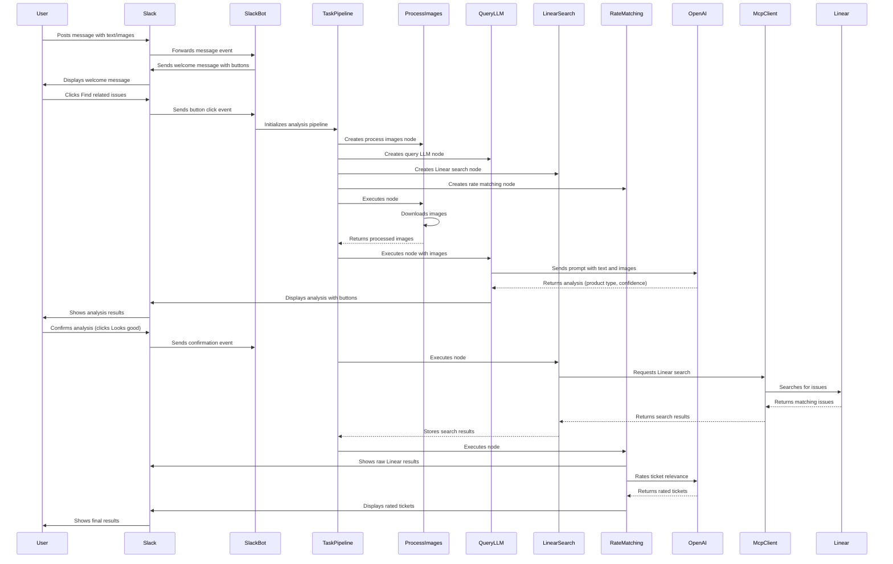

```mermaid
sequenceDiagram
    participant User
    participant Slack
    participant SlackBot
    participant TaskPipeline
    participant ProcessImages
    participant QueryLLM
    participant LinearSearch
    participant RateMatching
    participant OpenAI
    participant McpClient
    participant Linear

    %% Initial user interaction
    User->>Slack: Posts message with text/images
    Slack->>SlackBot: Forwards message event
    SlackBot->>Slack: Sends welcome message with buttons
    Slack->>User: Displays welcome message
    User->>Slack: Clicks Find related issues
    Slack->>SlackBot: Sends button click event

    %% Analysis pipeline setup
    SlackBot->>TaskPipeline: Initializes analysis pipeline
    TaskPipeline->>ProcessImages: Creates process images node
    TaskPipeline->>QueryLLM: Creates query LLM node
    TaskPipeline->>LinearSearch: Creates Linear search node
    TaskPipeline->>RateMatching: Creates rate matching node

    %% Pipeline execution - Image processing
    TaskPipeline->>ProcessImages: Executes node
    ProcessImages->>ProcessImages: Downloads images
    ProcessImages-->>TaskPipeline: Returns processed images

    %% Pipeline execution - LLM query
    TaskPipeline->>QueryLLM: Executes node with images
    QueryLLM->>OpenAI: Sends prompt with text and images
    OpenAI-->>QueryLLM: Returns analysis (product type, confidence)
    QueryLLM->>Slack: Displays analysis with buttons
    Slack->>User: Shows analysis results
    User->>Slack: Confirms analysis (clicks Looks good)
    Slack->>SlackBot: Sends confirmation event

    %% Pipeline execution - Linear search
    TaskPipeline->>LinearSearch: Executes node
    LinearSearch->>McpClient: Requests Linear search
    McpClient->>Linear: Searches for issues
    Linear-->>McpClient: Returns matching issues
    McpClient-->>LinearSearch: Returns search results
    LinearSearch-->>TaskPipeline: Stores search results

    %% Pipeline execution - Rate matching
    TaskPipeline->>RateMatching: Executes node
    RateMatching->>Slack: Shows raw Linear results
    RateMatching->>OpenAI: Rates ticket relevance
    OpenAI-->>RateMatching: Returns rated tickets
    RateMatching->>Slack: Displays rated tickets
    Slack->>User: Shows final results
```
