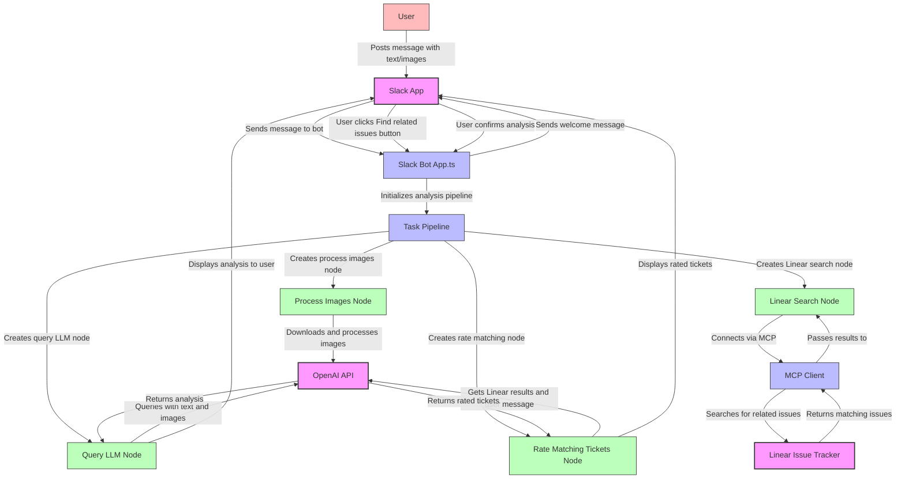

```mermaid
graph TD
    %% External Systems
    Slack[Slack App]
    OpenAI[OpenAI API]
    Linear[Linear Issue Tracker]

    %% Internal Components
    SlackBot[Slack Bot App.ts]
    TaskPipeline[Task Pipeline]
    McpClient[MCP Client]

    %% Task Pipeline Nodes
    ProcessImages[Process Images Node]
    QueryLLM[Query LLM Node]
    LinearSearch[Linear Search Node]
    RateMatching[Rate Matching Tickets Node]

    %% User Flow
    User[User] -->|Posts message with text/images| Slack
    Slack -->|Sends message to bot| SlackBot
    SlackBot -->|Sends welcome message| Slack
    Slack -->|User clicks Find related issues button| SlackBot

    %% Analysis Flow
    SlackBot -->|Initializes analysis pipeline| TaskPipeline
    TaskPipeline -->|Creates process images node| ProcessImages
    TaskPipeline -->|Creates query LLM node| QueryLLM
    TaskPipeline -->|Creates Linear search node| LinearSearch
    TaskPipeline -->|Creates rate matching node| RateMatching

    %% Execution Flow
    ProcessImages -->|Downloads and processes images| OpenAI
    QueryLLM -->|Queries with text and images| OpenAI
    OpenAI -->|Returns analysis| QueryLLM
    QueryLLM -->|Displays analysis to user| Slack
    Slack -->|User confirms analysis| SlackBot

    %% Linear Integration
    LinearSearch -->|Connects via MCP| McpClient
    McpClient -->|Searches for related issues| Linear
    Linear -->|Returns matching issues| McpClient
    McpClient -->|Passes results to| LinearSearch

    %% Rating Flow
    RateMatching -->|Gets Linear results and user message| OpenAI
    OpenAI -->|Returns rated tickets| RateMatching
    RateMatching -->|Displays rated tickets| Slack

    %% Legend/Styling
    classDef externalSystem fill:#f9f,stroke:#333,stroke-width:2px;
    classDef internalComponent fill:#bbf,stroke:#333,stroke-width:1px;
    classDef pipelineNode fill:#bfb,stroke:#333,stroke-width:1px;
    classDef user fill:#fbb,stroke:#333,stroke-width:1px;

    class Slack,OpenAI,Linear externalSystem;
    class SlackBot,TaskPipeline,McpClient internalComponent;
    class ProcessImages,QueryLLM,LinearSearch,RateMatching pipelineNode;
    class User user;
```
